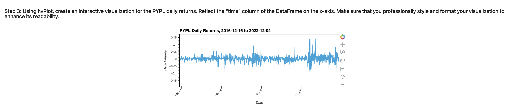

# ETF Loan Analyzer

 This Jupyter notebook builds a financial database and web application by using SQL, Python, and the Voilà library for the purpose of analyzing the performance of a hypothetical fintech ETF consisting of four stocks: GOST, GS, PYPL, and SQ. Each stock has its own table in the etf.db database (included in this repo).

---

## Technologies

This application leverages python 3.7 with the following packages:

* pandas: an open-source library that offers easy-to-use data analysis tools for Python.
* pathlib: for creation of file paths allowing the application to interact with a computer's filesystem.
* hvplot.pandas: a visualization library included in the PyViz package that can produce advanced charts    
  and interactive visualizations. 
* sqlalchemy: a library that facilitates the communication between a Python program and a database created from a Jupyter notebook.  
* voila: turns Jupyter notebooks into standalone web applications.

---

## Installation Guide

Begin by cloning the GitHub repo (the same repo that this README.md file is contained within) into your terminal. 

Then activate the correct environment by inputting the following command into your terminal:

`conda activate dev`

Within this environment, next install the above listed dependencies. To do so, in your terminal while in this same repo, enter `pip install -r requirements.txt`.

The hvPlot library needs to be installed seperately. To do so, in your terminal enter `conda install -c pyviz hvplot`.

Next, while in your IDE, open the "etf_analyzer.ipynb" notebook file and run the code. 

Optional: If you would like to deploy this notebook as a Web Application through the use of the Voilà library, make sure to install Voilà in your terminal with `conda install -c conda-forge voila`.

To use Voilà, first navigate to the folder containing the etf_analyzer.ipynb notebook in your terminal and then enter: `voila etf_analyzer.ipynb`. Here is an example of a segment of the output:

---

## Usage

The first part of this notebook analyzes PayPal (PYPL). It makes an SQL query to obtain all data from the PYPL table. Using hvPlot, an interactive visualization for the PYPL daily returns is created as well as an interactive visualization for the PYPL cumulative returns. 

The closing prices for PYPL that are greater than 200 are then selected with another SQL query. Further, again using an SQL query, the top 10 daily returns for PYPL are obtained.

Next, using SQL, the notebook builds an ETF portfolio and then evaluates its performance. To do so, an SQL query is used to access each table in the database and joins them into a single DataFrame. The daily returns are then calculated for each stock, followed by the daily returns for the entire ETF by averaging the daily returns of each stock for a given day (assuming an equal-weighted portfolio). These ETF daily returns are then used to calculate the annualized returns and the cumulative returns for the ETF. The cumulative return values of the ETF portfolio are visualized with an interactive line plot using hvPlot.

---

## Contributors

Nicole Roberts,
elle.nicole.roberts@gmail.com

---

## License

[BSD 3](https://choosealicense.com/licenses/bsd-3-clause-clear/): BSD 3-clause is a permissive licence, allowing nearly unlimited freedom with the software as long as BSD copyright and license notice is included.
